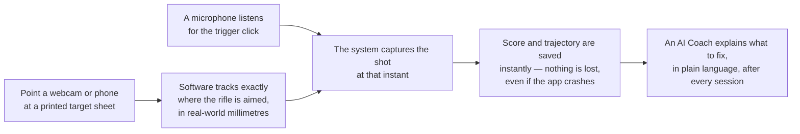
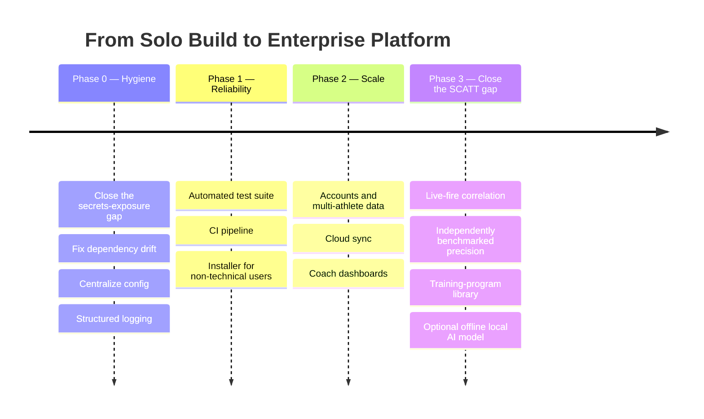

# AimGuruu — Enterprise & Commercial Case

**For:** club owners, coaches, potential partners/investors, non-engineering stakeholders.
**Engineering due diligence:** every technical claim about AimGuruu itself is backed by **[`ARCHITECTURE.md`](./ARCHITECTURE.md)** — link it, don't restate it.
**Build story:** for how this was actually built and what that process says about the engineer, see **[`FDE_WALKTHROUGH.md`](./FDE_WALKTHROUGH.md)**.

> **On the numbers in this document:** every SCATT, SIUS, ISSF, CMP, NCAA, and market-size figure below is from a live web search against the vendors' own sites, official federation pages, or named market-research publishers — sourced, not estimated. They're listed in **§7 Sources** with the exact page. Two numbers are explicitly *not* real research: the "Illustrative Pricing Model" in §5 is a proposed model for AimGuruu's own future pricing, not a researched competitor figure, and is labeled as such inline.

---

## 1. The Problem — With Real Numbers

*(Full sourced breakdown — pricing table, participation data, market sizing — now lives in **[`PROBLEM_STATEMENT.md`](./PROBLEM_STATEMENT.md)**; summarized here, not restated.)*

Electronic shot-tracking trainers — **SCATT** (Russian-made, the de facto standard for dry-fire training) and **SIUS** (Swiss-made, ISSF's official competition-timing/target partner) — let a shooter dry-fire indoors and see exactly where each shot would have landed. Verified current pricing runs **$947–$2,351 for SCATT** and **~$2,000–$5,857+ for SIUS** — a real $950–$6,000+ range, not a flat "$3–8k." That range sits against a large, well-documented population that can't clear it: ISSF's 163 member federations across 149 countries, and in the U.S. alone an estimated ~250,000 youth in CMP-affiliated 3-position air rifle.

**AimGuruu's actual claim:** not "as good as a $6,000 SIUS system" (see §4 below for exactly where SCATT still wins). The claim is closing the $0-to-$950 gap for that population, using hardware they already own.

## 2. Who This Is For Today — and Who It Isn't Yet

*(Canonical version, reused verbatim: **[`TARGET_PERSONAS.md`](./TARGET_PERSONAS.md)**.)*

| Persona | Fits today? |
|---|---|
| **The Priced-Out Competitor** — junior/collegiate ISSF or CMP-affiliated air-rifle shooter | **Yes** |
| **The Home Hobbyist** — casual airgun/dry-fire enthusiast | **Yes** |
| **The Club/Academy Coach** — manages a squad of 6–15 athletes | **Not yet — Phase 2** |
| **The Federation / Talent-ID Program** — standardized analytics across locations | **Not yet — Phase 3, aspirational** |

Being upfront about this split is a feature of this pitch, not a weakness: it shows exactly which investment unlocks which customer, rather than overclaiming what a solo-built MVP already does.

## 3. How It Works (Plain-Language View)

*(Engineering detail behind each box is in `HLD.md`, `LLD.md`, and `DATA_FLOW.md`.)*

## 4. SCATT vs. AimGuruu — What the Gap Actually Is

This is the section that matters most for credibility: naming the real gap precisely, instead of a vague "we're cheaper." Researched directly from SCATT's own product pages, FAQ, and user manual.

| Dimension | SCATT (verified) | AimGuruu (today) | The actual gap |
|---|---|---|---|
| **Tracking hardware** | A dedicated optical/IR sensor (30–56g) mounted directly on the gun barrel (most models); the MX-02 model instead uses a camera aimed at the target — architecturally the closest thing to AimGuruu in SCATT's own lineup | A generic webcam or phone (via IP-Webcam), camera fixed off-gun, aimed at a printed ArUco target sheet | AimGuruu needs zero dedicated hardware; SCATT's non-MX-02 models need a sensor physically fitted to the specific gun |
| **Shot detection** | A microphone *built into the gun-mounted sensor*, registering the trigger click at point-blank range | A room-placed microphone using rolling-baseline transient-ratio detection (`LLD.md` §2) | Same underlying principle (acoustic click detection) — SCATT's mic sits millimetres from the source and gets a cleaner signal; AimGuruu's ambient mic has to work harder to reject room noise |
| **Trajectory visualization** | Color-coded time-phased trace — SCATT's own documentation describes green (settling)/yellow (~1s before the shot)/red (post-shot follow-through), with a 4th (blue) phase noted in at least one version of the software | Color-coded trace: green (>1s, approach) / yellow (0.2–1s, hold) / red (≤0.2s, trigger break) | **Not a gap — a validation point.** AimGuruu converged on essentially the same visual language independently; the code's own comments cite "SCATT Standard" explicitly. Worth stating plainly in an interview or pitch: this wasn't guessed, it was built to match the industry convention. |
| **Live-fire support** | Yes — SCATT Basic is rated for dry-fire *and* live-fire, indoors or outdoors, up to 50m | Dry-fire only; there is no design today for correlating a tracked aim point with an actual bullet's point of impact | Real, currently unaddressed gap — tracked in the roadmap (§6) |
| **Precision transparency** | Not publicly disclosed — sampling rate and angular accuracy don't appear in SCATT's public FAQ, product pages, or user manual for the MX-W2 | Every parameter is open and in source: ~66Hz UI tick, ArUco sub-pixel corner refinement, homography via RANSAC (`LLD.md` §1, `ARCHITECTURE.md` §5 Appendix) | Neither a win nor a loss — a genuine difference in posture: SCATT is a closed, presumably well-calibrated proprietary instrument; AimGuruu is a fully inspectable pipeline whose actual precision hasn't been independently benchmarked against a reference system yet |
| **Software maturity** | Decades-old product line; SCATT Basic software runs cross-platform (Windows/Mac/Linux, plus a mobile "SCATT Expert" app); the more advanced SCATT Pro software is Windows-only (Mac requires a VM); supports up to 4 shooters simultaneously from one PC | Single-machine, single-session desktop app; one AI-generated coaching report, no training-program library, no elite-shooter benchmark comparisons | Real, large gap — SCATT's software depth is the product of years of iteration; closing it is a roadmap item, not a weekend fix |
| **Price** | $947–$2,351 (SCATT) to $2,000–$5,857+ (SIUS), verified above | ~$0 incremental hardware cost for anyone who owns a webcam or phone | This is the actual pitch — not "better," cheaper by a wide, verifiable margin |
| **Track record** | Established manufacturer, used across many national federations for years | Solo-built, pre-revenue software project | Real gap in trust/credibility that no amount of feature-matching closes by itself — addressed in the roadmap through packaging, testing, and (eventually) third-party validation, not by claiming otherwise |

## 5. Illustrative Pricing Model *(AimGuruu's own proposed pricing — not a researched competitor figure)*

| Tier | Proposed price | Who it's for | What it needs (see Roadmap) |
|---|---|---|---|
| **Free** | $0 | Home Hobbyist, single device | Nothing new — this is close to today's build |
| **Pro** | ~$9–15/mo | Priced-Out Competitor who wants cloud backup + session history across devices | Phase 2: cloud sync |
| **Club/Academy** | ~$99–199/mo per club | Coach managing a squad | Phase 2: accounts, multi-athlete dashboards |
| **Federation** | Custom / enterprise contract | Talent-ID and standardized cross-location analytics | Phase 3: multi-tenant backend, compliance/security hardening |

Even the Club/Academy tier still undercuts a single SCATT Basic unit ($947) within the first year for any club fielding more than one or two athletes — the pricing logic follows directly from §1's real numbers, not from a made-up TAM.

## 6. Roadmap — Now Informed by the Real Competitive Gap

- **Phase 0 — Hygiene** *(cheap, fast, table stakes)*: closes real, already-identified gaps — an unprotected API key path, a dependency mismatch, hardcoded config, `print()`-only diagnostics. Full list in `ARCHITECTURE.md` §4.
- **Phase 1 — Reliability** *(unlocks: trustworthy releases)*: a real test suite and CI mean features can ship without re-manually-verifying the vision and scoring math every time; a packaged installer means the Home Hobbyist and Priced-Out Competitor personas can actually install this without a Python environment.
- **Phase 2 — Scale** *(unlocks: the Club/Academy Coach persona and the Pro/Club pricing tiers above)*: turns a single-player tool into a multi-seat product with recurring revenue.
- **Phase 3 — Close the SCATT gap directly** *(unlocks: credible comparison against real competitors, not just price)*: this phase is now scoped from §4's actual findings, not a generic wishlist — live-fire point-of-impact correlation, a published precision benchmark against a reference system (closing the "precision transparency" row honestly, in either direction), a training-program library comparable to SCATT Pro's, and an offline local-model option to remove the free-tier LLM dependency named directly in §1's software-maturity row.

## 7. Sources

- SCATT pricing and specs: [scatt.com](https://www.scatt.com/) (MX-W2, MX-02, Basic product pages, FAQs), [scattusa.com](https://scattusa.com/) (official North American distributor, pricing and FAQ), [olympicpistol.com MX-W2 manual](https://www.olympicpistol.com/mxw2man/)
- SIUS pricing: [siususa.com](https://www.siususa.com/), historical quotes via [TargetTalk forum](https://www.targettalk.org/viewtopic.php?t=61091)
- ISSF federation count: [issf-sports.org member federations](https://www.issf-sports.org/issf/organisation/member-federations)
- CMP junior participation: [thecmp.org Three-Position National Postal Competition](https://thecmp.org/three-position-national-postal-competition/)
- NCAA rifle programs: [Wikipedia — List of NCAA rifle programs](https://en.wikipedia.org/wiki/List_of_NCAA_rifle_programs)
- Market sizing: [Grand View Research — Shooting Sports Equipment Market](https://www.grandviewresearch.com/industry-analysis/shooting-sports-equipment-market-report), [DataHorizzon Research — Shooting Sports Equipment Market](https://datahorizzonresearch.com/shooting-sports-equipment-market-25712)
- Forward Deployed Engineer role: [Wikipedia — Forward Deployed Engineer](https://en.wikipedia.org/wiki/Forward_Deployed_Engineer), [Palantir Engineering Blog](https://blog.palantir.com/a-day-in-the-life-of-a-palantir-forward-deployed-software-engineer-45ef2de257b1)

## Appendix

Full engineering due diligence starts at **[`ARCHITECTURE.md`](./ARCHITECTURE.md)** (which indexes `PROBLEM_STATEMENT.md`, `TARGET_PERSONAS.md`, `HLD.md`, `LLD.md`, `USER_WORKFLOW.md`, and `DATA_FLOW.md`). The build narrative lives in **[`FDE_WALKTHROUGH.md`](./FDE_WALKTHROUGH.md)**, and the case against building this a different way lives in **[`ALTERNATIVE_ARCHITECTURES.md`](./ALTERNATIVE_ARCHITECTURES.md)**.
