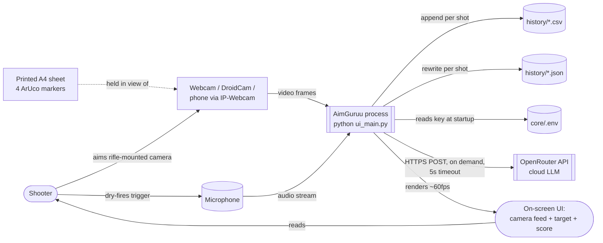
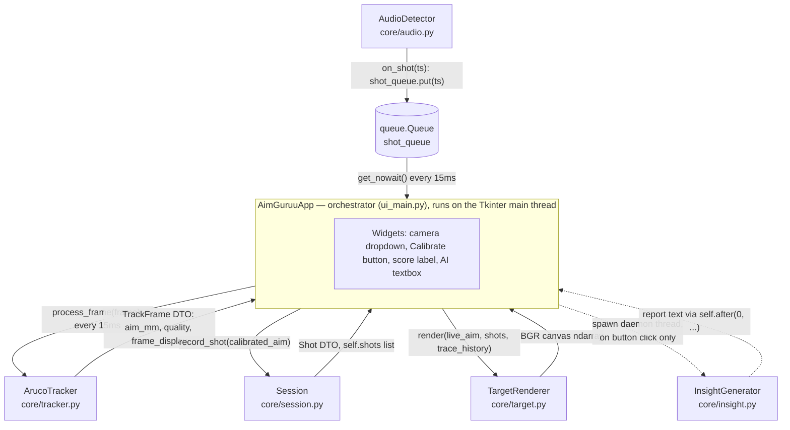
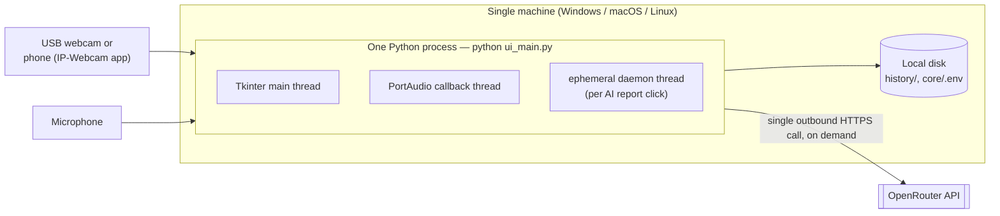
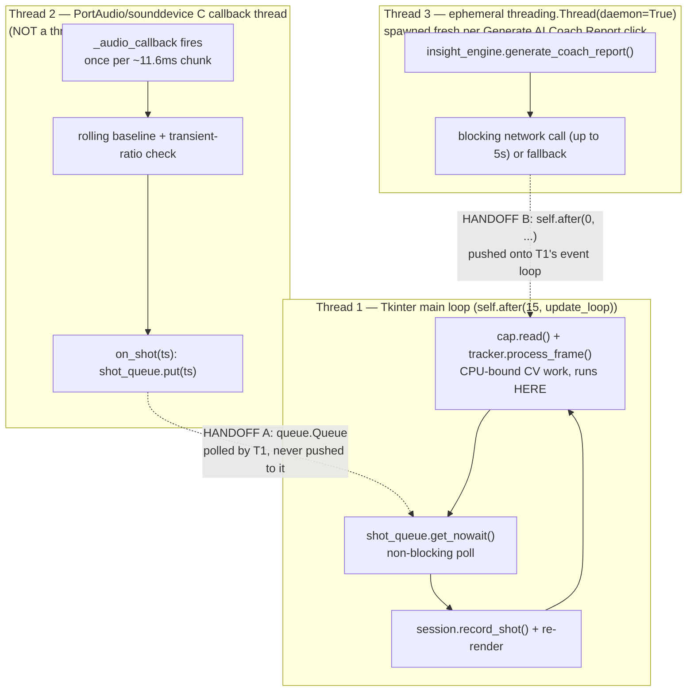
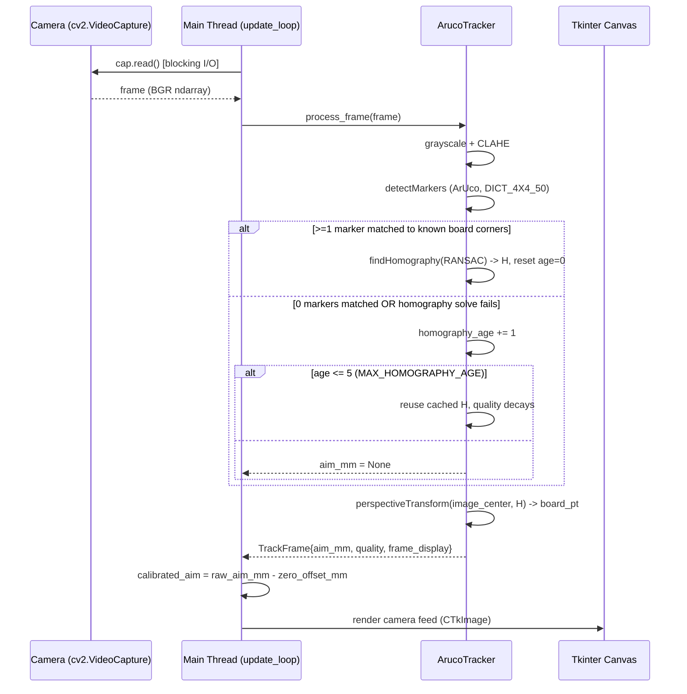
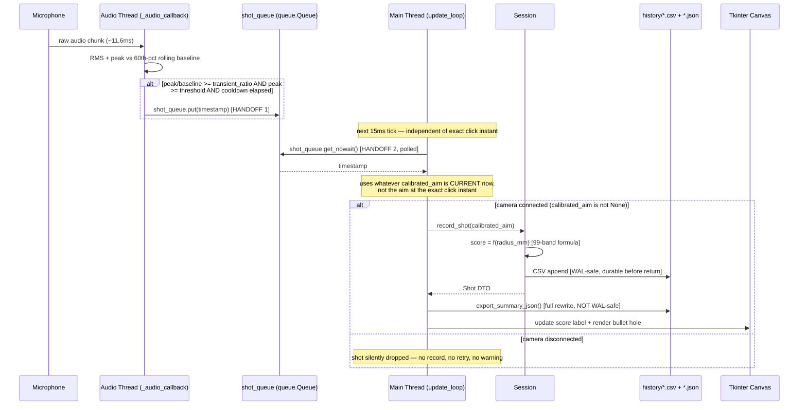
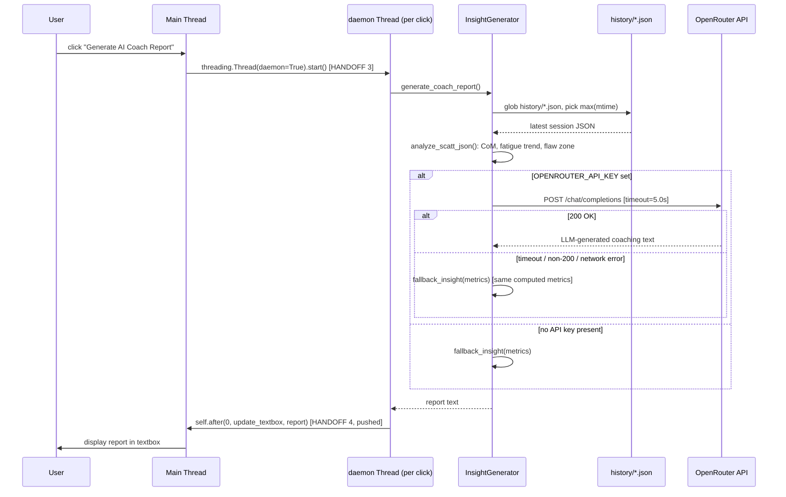

# AimGuruu — Architecture Reference

**Status:** living technical reference · **Scope:** the codebase as it exists today (`ui_main.py` + `core/*.py`) · **Not scope:** business framing or interview delivery — see the companions below.

## 1. Purpose & How to Use These Docs

This is the single source of truth for how AimGuruu actually works — every number, threshold, and formula here is read directly from source, not paraphrased from memory. Two companion documents point back into this one instead of restating facts, so nothing drifts out of sync:

- **[`INTERVIEW_PREP.md`](./INTERVIEW_PREP.md)** — short, spoken-format cheat sheet for defending this architecture live.
- **[`PITCH.md`](./PITCH.md)** — the enterprise/commercial case, with researched (not estimated) SCATT/SIUS pricing, market data, and a detailed SCATT-vs-AimGuruu gap analysis.
- **[`FDE_WALKTHROUGH.md`](./FDE_WALKTHROUGH.md)** — the build narrative, told through a Forward Deployed Engineer's working method.
- **[`ALTERNATIVE_ARCHITECTURES.md`](./ALTERNATIVE_ARCHITECTURES.md)** — full whole-system alternatives (cloud vs. local, mobile-native, event-bus, SQLite, etc.) and why each was or wasn't chosen. §6/§7 below cover component-level tradeoffs and decisions already made; that document covers the bigger "why not build the whole thing differently" questions.

If you only read one section before an interview, read §4.6 (Concurrency Model) and §5 (Data Flow) — they're where most real interview questions land.

*(All diagrams below are Mermaid, embedded as fenced code blocks. GitHub, GitLab, and most modern Markdown viewers render these natively; in VS Code, install the "Markdown Preview Mermaid Support" extension if your preview shows raw text instead of a diagram.)*

---

## 2. Problem Statement & Target Personas

**Problem.** Olympic-style electronic shot-tracking trainers (SCATT, SIUS) let a shooter dry-fire indoors and see exactly where each shot would have landed, which is how competitive air-rifle/air-pistol athletes train between live-range sessions. Verified current pricing runs **$947–$2,351 for SCATT** and **~$2,000–$5,857+ for SIUS** (see `PITCH.md` §1 for the full sourced breakdown) — real money that puts them out of reach for individual juniors, most clubs, and casual shooters. AimGuruu reproduces the core loop — real-time aim tracking, shot capture, scoring, and trend feedback — using a webcam (or a phone via IP-Webcam) and a microphone instead of proprietary optics and electronics, at close to zero incremental hardware cost.

**Personas.** The table below is intentionally honest about *today's* capability vs. what requires roadmap work — a persona this codebase can't yet serve is listed as a roadmap target, not a current fit:

| Persona | Fits today? | Why |
|---|---|---|
| **The Priced-Out Competitor** — a junior/collegiate ISSF or NRA air-rifle shooter who wants dry-fire feedback between club sessions but can't justify $3–8k hardware | **Yes, as-is** | Single-user, single-machine, local `history/` folder — exactly matches one athlete training alone. This is the current product. |
| **The Home Hobbyist** — a casual airgun/dry-fire enthusiast who wants a feedback loop and score tracking for habit-building, not competition prep | **Yes, as-is** | Identical technical fit to the persona above; differs only in motivation, which matters for pricing/positioning (see `PITCH.md`), not for what the software must do. |
| **The Club/Academy Coach** — manages 6–15 athletes and wants to review sessions across a squad | **No — Phase 2** | There are no accounts, no per-athlete separation beyond manually renaming the app on launch, and no aggregation view. Every athlete's shots land in the same local `history/` folder undifferentiated except by filename timestamp. |
| **The Federation / Talent-ID Program** — wants standardized analytics across multiple locations for talent identification | **No — Phase 3, aspirational** | Requires auth, a real multi-tenant backend, and cloud storage — none of which exist. Belongs in the roadmap, not the current pitch. |

---

## 3. High-Level Design

### 3.1 System Context

**What this says:** AimGuruu is a single process with no server of its own. It has exactly one outbound network dependency (OpenRouter, and only when the user clicks "Generate AI Coach Report"), and its only persistent store is the local filesystem. There is no database, no accounts, and nothing multi-tenant — that absence is deliberate for the current scope (see ADR-006) and is the main thing Phase 2/3 of the roadmap (§8) exists to change.

### 3.2 Component Diagram

**What this says:** `AimGuruuApp` is the only component that talks to every other component — nothing talks to anything else directly. `shot_queue` is drawn as its own node deliberately: it's the entire thread-safety boundary between the audio subsystem and everything else, not an implementation detail.

### 3.3 Deployment View

**What this says — mostly by omission:** there is no app server, no database server, no load balancer, no message broker, no container orchestration. One machine, one process, three threads, one outbound call. That's not a gap in the diagram — it's the actual topology, and §8 is precisely the roadmap for what has to be added to each layer to reach an enterprise deployment.

### 3.4 Concurrency & Threading Model

This is the single most interview-relevant diagram in this document. AimGuruu has **three execution contexts that are not symmetric with each other** — conflating them (e.g., saying "it's multi-threaded" without distinguishing *how*) is the easiest way to sound like you don't actually understand your own system.

Two things worth being precise about, because they're genuinely different mechanisms:

- **Handoff A (audio → UI) is pull-based.** The audio thread never touches the UI. It only ever does `shot_queue.put(timestamp)`. The main thread polls `shot_queue.get_nowait()` on its own 15ms cadence and simply won't notice a shot until the next tick — worst case ~15ms of added latency, which is irrelevant next to human reaction time but matters for exactly *which* video frame's aim point gets attributed to the shot (see Flow B, §5.2).
- **Handoff B (AI worker → UI) is push-based.** `self.after(0, callback, report)` schedules `callback` to run on the Tkinter event loop as soon as it's next idle — this is Tkinter's sanctioned way to marshal a result from a background thread onto the thread that owns the UI. There's no polling and no queue involved.
- **Thread 2 is not `threading.Thread`.** `sounddevice.InputStream` hands its callback to PortAudio, a C library, which runs it on its own OS thread. This is worth stating precisely in an interview — "I spawned a background thread for audio" is not quite what happened; the audio library owns that thread, and `_audio_callback` is just the function it calls into.
- **`AudioDetector.pause()` is designed but unwired.** It exists, is `threading.Lock`-guarded, and is checked inside `_audio_callback` — but nothing in `ui_main.py` currently calls it. It's there for a "mute audio while in a menu" feature that was never connected to a UI control. Worth naming as "designed, not yet wired up" rather than either claiming it's a feature or pretending it doesn't exist.

---

## 4. Low-Level Design

Each module below follows the same template: **Responsibility → Inputs/Outputs → Core algorithm (with *why*) → State & lifecycle → Failure modes → Performance → Thread-safety contract.**

### 4.1 `core/tracker.py` — `ArucoTracker`

**Responsibility.** Convert a raw camera frame into a real-world millimetre offset of the rifle's aim point from the target's true center.

**I/O.** In: a BGR `numpy.ndarray` frame. Out: a `TrackFrame` dataclass — `aim_mm`, `aim_px`, `markers_found`, `frame_display` (annotated copy for the UI), `homography`, `quality` (0.0–1.0).

**Core algorithm.**
1. Convert to grayscale, then apply **CLAHE** (`clipLimit=4.0`, `tileGridSize=(8,8)`) — indoor lighting is uneven, and CLAHE normalizes local contrast so the black/white ArUco pattern stays detectable without needing bright, even lighting. Cost is negligible (~2ms per frame).
2. Detect markers from the `DICT_4X4_50` dictionary with `CORNER_REFINE_SUBPIX` enabled — subpixel refinement analyzes image gradients around each corner to locate it to a fraction of a pixel, which is what makes millimetre-level accuracy possible at all; integer-pixel corners alone would be far too coarse.
3. Match any detected marker IDs (0=TL, 1=TR, 2=BR, 3=BL of a printed A4 sheet) against hardcoded real-world millimetre corner positions, then compute a **homography matrix** via `cv2.findHomography(..., cv2.RANSAC, 5.0)`. RANSAC discards outlier corner detections (e.g., a partially-occluded marker) rather than letting one bad corner wreck the whole transform.
4. `cv2.perspectiveTransform` warps the camera image's exact center pixel through that matrix, yielding where that pixel actually lands on the physical target sheet, in millimetres. Subtract the sheet's known center to get `aim_mm`.

**A subtlety worth stating precisely:** the bail-out condition in code is "zero *markers* matched" (`len(img_pts) < 1`), not "fewer than 4 points." A homography needs ≥4 point correspondences, but each single marker contributes all 4 of its corners — so **one fully-visible marker alone is mathematically sufficient** to solve a homography. This is a real, non-obvious property of the design, not just a threshold picked by feel.

**State & lifecycle.** `_last_homography` and `_homography_age` persist across frames. If zero markers are matched (occlusion, motion blur, hand in frame), the tracker reuses the cached homography for up to `MAX_HOMOGRAPHY_AGE = 5` frames, with `quality` decaying (`max(0.1, 0.5 - age*0.1)`) each frame it's stale. This trades a few frames of slightly-wrong aim position for avoiding a visible freeze/stutter every time a marker is briefly occluded — see ADR-005.

**Failure modes.** Beyond 5 stale frames with no re-detection, `aim_mm` becomes `None` and the UI simply shows no crosshair — there's no "target lost" message to the user distinguishing "camera unplugged" from "markers occluded too long."

**Performance.** O(1) per frame relative to image size for the marker-matching/homography math; the dominant cost is OpenCV's marker detection itself, plus the ~2ms CLAHE pass. Runs entirely on the Tkinter main thread (see §3.4) — there is no dedicated CV thread.

**Thread-safety contract.** Not thread-safe by design, and doesn't need to be — it's only ever called from the main thread's `update_loop`.

### 4.2 `core/audio.py` — `AudioDetector`

**Responsibility.** Detect the acoustic "click" of a dry-fire trigger break without a real gunshot, while ignoring speech, footsteps, and HVAC noise — without ever blocking or being blocked by the video pipeline.

**I/O.** In: a continuous microphone stream via `sounddevice.InputStream`. Out: calls `on_shot(timestamp)` exactly once per detected shot (subject to cooldown).

**Core algorithm — why not a volume threshold.** A naive "if volume > X, it's a shot" approach was explicitly rejected (per the code's own architectural comment) because it falsely triggers on any generally loud sound (talking, a passing car). Instead:
1. Each ~11.6ms audio chunk (`chunk_size=512` samples @ `sample_rate=44100`) yields an RMS (average loudness) and a peak (loudest single sample).
2. RMS values are pushed into a rolling `deque` of the last 40 chunks (≈0.5s of audio). The **60th percentile** of that window — not the mean — is used as the ambient baseline. Percentile-based baselining is deliberately robust to a single loud outlier briefly appearing in the window; a mean would drag the baseline up and make the detector temporarily less sensitive right after any loud noise.
3. `ratio = peak / baseline`. A shot fires only if **both** `peak >= threshold` (an absolute floor) **and** `ratio >= transient_ratio` (a sharp *relative* spike) — the AND of both conditions is what distinguishes "sharp percussive click" from "someone is talking loudly."
4. A `cooldown_ms` window (default 800ms) suppresses re-triggering, because a real trigger mechanism's spring can produce a secondary mechanical vibration that would otherwise register as a second shot.

**Runtime values actually used differ from the class defaults** — see the ground-truth table in §9; `ui_main.py` overrides `threshold` and `transient_ratio` but not `cooldown_ms`, `sample_rate`, or `chunk_size`.

**State & lifecycle.** `_baseline_buf` (deque), `_last_trigger_time`, and the `_paused`/`_lock` pair persist for the life of the `AudioDetector` instance, which is created once at app startup and lives until `stop()` is called on window close.

**Failure modes.** If `sounddevice` isn't installed, `start()` prints an error and silently does nothing further — the app keeps running with no audio detection and no visible warning in the UI itself, only a console `print()`. If the input stream throws during `start()` (e.g., no microphone present), the same silent-degradation pattern applies.

**Performance.** `_audio_callback` must be fast because it runs on PortAudio's real-time audio thread; the work per call is O(1) (a percentile over a fixed 40-element window, a few comparisons) — no per-call allocation of note beyond the numpy cast.

**Thread-safety contract.** `_audio_callback` runs entirely on the PortAudio callback thread (§3.4, Thread 2) and never touches Tkinter state — it only ever writes to instance attributes read elsewhere for UI monitoring (`current_level`, `current_peak`, `current_baseline`, currently unused by the UI) and calls `on_shot`, which does nothing but `queue.put()`. The `_lock` guards only the `_paused` flag, the one piece of state the main thread is allowed to mutate via `pause()`.

### 4.3 `core/session.py` — `Session` & `Shot`

**Responsibility.** Score each shot, hold the session's shot history in memory, and persist it to disk immediately and durably enough that a crash mid-session loses nothing already fired.

**I/O.** In: `record_shot(aim_mm)`. Out: a `Shot` dataclass (`index`, `timestamp`, `aim_mm`, `score`, computed `radius_mm` via Pythagorean distance) plus two files per session under `history/`.

**Core algorithm — scoring.** The scoring radius (`22.75mm` default) is divided into 99 equal-width bands (`band_w = 22.75/99 ≈ 0.2298mm`). A shot's score is `round(10.9 - band_n * (9.9/98), 1)`, where `band_n = min(int(radius/band_w), 98)` — i.e., a linear decimal scoring scale from 10.9 (dead center) down to roughly 1.0 at the outer edge of the scoring rings, matching ISSF-style decimal scoring rather than integer ring scoring. Anything beyond the scoring radius scores exactly `0.0`.

**Core algorithm — Extreme Spread.** `group_size_mm` is the maximum pairwise Euclidean distance across *all* recorded shots, computed with a **double nested loop — O(n²)**. This is a genuine, known complexity tradeoff (see §6, row 3), not an oversight: at realistic session sizes (tens of shots) it's imperceptible, and it's simpler and more obviously correct than a convex-hull-based approach.

**Persistence — Write-Ahead Logging.** The CSV file is opened and header-written once in `__init__`, then opened in append mode and immediately flushed on every single `record_shot()` call — this is genuinely WAL-style: each shot is durable on disk before the function returns, independent of anything else happening in the app. `export_summary_json()`, by contrast, is a **full file rewrite** every time it's called (which happens after *every* shot, not just at session end — see the correction in Flow B, §5.2) — this file is *not* crash-safe in the same sense: if the process dies mid-write, the JSON can be left truncated or reflect a slightly stale shot count, even though the CSV for the same session is always fully correct up to the last completed shot.

**Failure modes.** No exception handling around any file I/O — if the `history/` directory becomes unwritable mid-session (disk full, permissions), `record_shot()` will raise and the shot's score is lost from persistence even though it may still show on-screen.

**Performance.** `record_shot` is O(1) amortized (one score calc, one disk append). `group_size_mm` is O(n²) per *call*, and it's called after every shot to refresh the scoreboard — meaning total work across an n-shot session is O(n³) in the worst case (recomputed from scratch each time). Fine at real session sizes; the tradeoffs table flags where it would stop being fine.

**Thread-safety contract.** `Session` is only ever touched from the main thread — no locks, none needed under current usage.

### 4.4 `core/target.py` — `TargetRenderer`

**Responsibility.** Draw the ISSF-style target face, the live crosshair, all recorded shot holes, and a fading color-coded trajectory trace, at up to ~66Hz, without redrawing static geometry every frame.

**Core algorithm — static/dynamic layer caching.** The ten concentric rings (real ISSF 10m air-rifle radii, rings 4–9 painted black per spec) are rendered exactly once into `_static_bg` at construction time. Every `render()` call copies that cached background and composites the live crosshair, shot holes, and trace polyline on top — avoiding the cost of redrawing static geometry 60+ times per second.

**Core algorithm — trace coloring.** Each point in `trace_history` is colored by its age relative to *now*, not by any absolute timestamp: `>3.0s` → dropped, `>1.0s` → green (approach), `>0.2s` → yellow (hold), `≤0.2s` → red (trigger break) — reproducing SCATT's standard visual convention for stability analysis. `trace_history` is a `deque(maxlen=200)` filled once per 15ms tick, so 200 entries ≈ 3 seconds of history, matching the 3.0s fade cutoff by construction.

**Failure modes.** None of note — pure rendering, no I/O, no external state beyond what's passed in.

**Performance.** O(rings) once at construction; O(trace points + shots) per frame thereafter, all cheap OpenCV primitive draws.

**Thread-safety contract.** Called only from the main thread; stateless per call aside from the pre-rendered background.

### 4.5 `core/insight.py` — `analyze_scatt_json()` and `InsightGenerator`

**Responsibility.** Turn raw shot coordinates into a human-readable coaching insight — worthless without this layer, since "x = -4.5, y = 2.1" means nothing to a shooter.

These are two genuinely separable concerns living in one file:

**`analyze_scatt_json(session_data)` — pure function, no I/O.**
- **Center of Mass:** mean of all `x` and `y` — where the group is centered, independent of score.
- **Fatigue trend:** splits shots at the midpoint index; compares the average score of the first half vs. second half; `"Degrading"` if the second half is worse, else `"Improving/Stable"`.
- **Dominant flaw zone:** for shots scoring `< 8.0` only, classifies by position into one of four labeled biases (`Left → Canting/Eye strain`, `Top-Right → Heeling/Anticipation`, `High → Breathing control error`, `Low → Jerking trigger`), then takes the most frequent label.

  **A real gap worth knowing before an interview asks about it:** the four conditions checked (`x<-5 and |y|<5`; `x>5 and y>5`; `y>5`; `y<-5`) don't partition the plane. A bad shot at, say, `x=6, y=2` matches none of them — it still counts toward `total_shots` and drags down `average_score`, but contributes *no vote* to the bias classification, silently. It isn't caught by the `else: "Inconsistent"` path either, because that path only triggers when the `biases` list is empty overall, not per-shot. This is a real, fixable classifier gap, not a design decision — good to name as exactly that if asked.

**`InsightGenerator` — the I/O and orchestration layer.**
- Finds the most recently modified `*.json` in `history/` (`max(json_files, key=os.path.getmtime)`) — note this means "AI Coach Report" always reflects whatever session file was touched most recently, which is the current session mid-run in practice, not necessarily a "completed" session (see the correction in Flow C, §5.3).
- Builds a single fixed prompt template embedding the computed metrics, and calls OpenRouter's chat-completions endpoint with a free-tier model, `timeout=5.0` seconds.
- **Graceful degradation is unconditional and total:** missing API key, non-200 response, or any `requests.exceptions.RequestException` (timeout, DNS failure, connection refused) all route to `fallback_insight(metrics)` — a fully deterministic, rule-based text generator using the *exact same computed metrics* the LLM prompt would have used. The user never sees an error state with no content; the app always produces *some* coaching text.

**Thread-safety contract.** `generate_coach_report()` is a blocking call (disk I/O + up to 5s of network I/O) — `ui_main.py` never calls it directly on the main thread; it's always dispatched to the ephemeral daemon thread described in §3.4, Thread 3.

### 4.6 `ui_main.py` — `AimGuruuApp` (orchestration)

**Responsibility.** Own the UI widgets and be the single place every other module's output converges, once per 15ms tick.

**The `update_loop()` heartbeat, in order, every tick:**
1. If a camera is connected: `cap.read()` (blocking I/O) → `tracker.process_frame()` (CPU-bound, on this same thread) → convert BGR→RGB→`CTkImage` → render camera panel.
2. Apply the calibration offset: `calibrated_aim = raw_aim_mm - zero_offset_mm`, where `zero_offset_mm` was captured once, whenever the user last clicked "Calibrate Zero Offset" (it simply stores whatever `latest_aim_mm` was at that instant as the new zero point — correcting for the camera being mounted slightly off from the barrel's true point of aim).
3. Append `calibrated_aim` to `trace_history` (only if a camera is connected and an aim point exists).
4. Non-blocking drain of `shot_queue`; if a timestamp was waiting **and** `calibrated_aim` is currently available, record the shot, update the scoreboard, and export the JSON summary.
5. Re-render the target canvas via `TargetRenderer.render(...)`.
6. Reschedule itself: `self.after(15, self.update_loop)`.

**A real edge case worth knowing:** if a shot is detected (step 4) while **no camera is connected** — `calibrated_aim` is `None` — the shot timestamp is still dequeued (consumed), but `record_shot()` is never called. **The shot is silently lost**, with no retry, no queued pending-shot state, and no user-facing warning. This is a genuine gap, not a documented design decision.

**Another real edge case:** `on_closing()` calls `self.audio_detector.stop()` then unconditionally `if self.cap.isOpened(): ...` — if the user closes the app without ever clicking "Connect Camera," `self.cap` is still `None`, and `None.isOpened()` raises `AttributeError`. A latent crash-on-clean-exit bug for a specific, plausible user path.

---

## 5. Complete Data Flow

Three sequence diagrams cover every corner of the runtime behavior — a fourth generic "data flow diagram" would only restate the component diagram in §3.2, so it's deliberately omitted.

### 5.1 Flow A — Camera frame → aim coordinate

### 5.2 Flow B — Dry-fire click → recorded shot → disk → UI update

### 5.3 Flow C — "Generate AI Coach Report" click → OpenRouter → fallback

*(Note: this is triggered by a button click, not by "session end" — `export_summary_json()` already runs after every shot, so the JSON `InsightGenerator` reads may reflect a session still in progress.)*

---

## 6. Architectural Tradeoffs

| Decision | Alternative(s) considered | Why this choice | Cost / limitation | When to revisit |
|---|---|---|---|---|
| ArUco fiducial markers + homography | Deep-learning pose estimation (e.g. YOLO-based marker/target detection) | Purely geometric — zero-lag on CPU, no GPU/model dependency, sub-pixel accurate out of the box | Requires a printed marker sheet in view at all times; can't track an unmarked/generic target | If the product needs to work without a printed target sheet at all |
| Homography reuse-with-decay on occlusion | Strict per-frame re-detection (fail if markers not visible) | Avoids visible stutter/freeze from momentary occlusion (hand, smoke, motion blur) | Up to 5 frames of slightly stale aim data during occlusion | If precision-critical scoring modes need to flag/exclude stale-homography shots |
| O(n²) Extreme Spread (`group_size_mm`) | Convex-hull-based max-distance algorithm (O(n log n)) | Simpler, obviously correct, negligible cost at real session sizes (tens of shots) | Becomes measurably slower at large n; it's also recomputed from scratch after every shot | If session sizes grow into the hundreds, or if this metric needs to run over multi-session aggregates |
| CV processing on the Tkinter main thread | Offload `process_frame` to a worker thread/process, hand results back via queue | Simpler code, no cross-thread synchronization needed for the largest chunk of per-frame work | A slow CV frame directly delays UI responsiveness and audio-queue draining in the same tick | If frame processing time ever approaches or exceeds the 15ms budget on target hardware |
| Cloud LLM (OpenRouter) + rule-based fallback | Local-only SLM (e.g. via Ollama) | No local model download/runtime dependency; free tier keeps cost at zero for a solo project | Requires network access for the "real" AI experience; free-tier model availability isn't guaranteed long-term | If offline range use becomes a requirement, or free-tier terms change |
| Dual persistence: CSV WAL (append) + JSON (full rewrite) | A single embedded database (SQLite) | No schema/migration overhead for a simple two-shape data model; CSV is trivially human-readable/exportable | Two files can fall out of sync on a crash between writes (§4.3); no query capability across sessions | Once cross-session analytics or multi-athlete data are needed (Phase 2) |
| Hardcoded global constants (scoring radius, marker/board mm, thresholds) | A config file / settings system | Fastest to build and reason about for a single fixed target spec | Any hardware variant (different target size, different marker layout) requires a code change | Before supporting more than one target/marker configuration |
| `print()` for all diagnostics | Structured logging (`logging` module, levels, log files) | Zero setup, fine for a single-developer console workflow | No log levels, no persistence, no way to diagnose a field issue after the fact | Before any multi-user or remote-support scenario |
| Manual print-and-eyeball harnesses (`phase1/2/3_test.py`) | An automated `pytest` suite with assertions | Fast to write during initial exploratory development | No regression protection — a change can silently break scoring or detection with no test failure | Immediately, before any further feature work (this is the highest-leverage Phase 1 item) |
| `queue.Queue` + `.after()` polling for thread coordination | `asyncio` throughout | Matches Tkinter's synchronous, callback-driven model directly; no need to bridge an event loop into a GUI toolkit that doesn't natively support one | Slightly higher worst-case latency (bounded by the 15ms poll interval) than a push-based design | Unlikely to need revisiting unless the UI framework itself changes |

*(The `pyaudio`-vs-`sounddevice` mismatch between `requirements.txt` and the actual import in `core/audio.py` is deliberately **not** a row here — there's no "why this choice" behind it, it's dependency drift. It's tracked as a Phase 0 hygiene item in §8 instead.)*

---

## 7. Architectural Decision Records

Reserved for decisions with consequences that ripple across modules — everything more local stays in the tradeoffs table above.

### ADR-001: Planar ArUco fiducials + homography for aim tracking
- **Context:** Need real-time, sub-millimetre-precision tracking of a camera's aim point relative to a printed target, on commodity CPUs, with zero acceptable added latency.
- **Decision:** Use OpenCV's ArUco marker detection plus a computed homography matrix, rather than any ML-based approach.
- **Consequences:** Deterministic, explainable, fast on CPU; requires the printed marker sheet to always be in frame; accuracy depends on camera focus/resolution and marker print quality.
- **Alternatives considered:** YOLO/deep-learning-based generic target or barrel-pose detection (rejected: adds latency and a model dependency for no accuracy benefit at this task's precision requirements).

### ADR-002: `queue.Queue` as the sole synchronization primitive between the audio thread and the Tkinter loop
- **Context:** A background audio thread must hand off shot events to a single-threaded GUI toolkit without race conditions or blocking either side.
- **Decision:** The audio callback only ever calls `queue.put()`; the UI loop only ever calls `get_nowait()`. No other shared mutable state crosses this boundary.
- **Consequences:** Simple, correct, well-understood pattern; introduces a bounded latency (up to one 15ms tick) between detection and recording.
- **Alternatives considered:** Direct callback into Tkinter from the audio thread (rejected: Tkinter is not thread-safe, this would risk crashes/corruption); `asyncio` event loop (rejected: doesn't compose cleanly with Tkinter's own loop).

### ADR-003: CSV Write-Ahead-Log + periodic JSON export, deferring a real database
- **Context:** Session data must survive a crash mid-session with minimal complexity for a single-developer, single-user MVP.
- **Decision:** Append each shot to a CSV synchronously; separately maintain a JSON summary rewritten after every shot for the AI Coach to consume.
- **Consequences:** Crash-safe at the per-shot CSV level; the JSON summary is not crash-safe to the same degree (§4.3); no cross-session querying.
- **Alternatives considered:** SQLite (rejected for MVP scope: adds schema/migration overhead not justified by a two-shape data model, given the current scope is one user, one machine).

### ADR-004: Cloud LLM coaching with a mandatory, metric-equivalent rule-based fallback
- **Context:** The AI Coach feature should not create a hard dependency on network availability or a specific external service's uptime.
- **Decision:** Always compute the same metrics locally first; attempt the cloud LLM call with a short (5s) timeout; on any failure, fall back to a fully deterministic text generator using those same metrics.
- **Consequences:** The user always receives a coaching report; report quality/nuance is lower in the fallback path than the LLM path, but never absent.
- **Alternatives considered:** Hard-requiring the API key and failing loudly if absent (rejected: makes the feature unusable offline or without setup); local SLM only (rejected for now: adds a runtime dependency, tracked as a Phase 3 roadmap option instead).

### ADR-005: Homography cache-with-decay on marker occlusion
- **Context:** Momentary occlusion of one or more markers (hand, smoke, fast motion) would otherwise cause visible tracking dropout every time it happens.
- **Decision:** Reuse the last known homography for up to 5 frames, with a confidence score that decays each stale frame, rather than immediately reporting "no aim point."
- **Consequences:** Smoother perceived tracking; up to 5 frames of aim data that may be slightly wrong if the camera actually moved during the occlusion.
- **Alternatives considered:** No caching (immediate `None` on any occlusion) — rejected as visibly worse UX for a cost that's usually imperceptible.

### ADR-006: Single-user, single-machine, local-storage scope is an intentional MVP boundary
- **Context:** It would be easy to read the absence of accounts, multi-user support, and cloud storage as an oversight.
- **Decision:** Explicitly scope the current build to one athlete, one machine, local storage — the Coach and Federation personas (§2) are deferred by design, not missed by omission.
- **Consequences:** Keeps current-state claims (in this doc and in `PITCH.md`) honest and defensible; makes Phase 2/3 of the roadmap (§8) a planned expansion rather than a discovered gap.
- **Alternatives considered:** Building multi-user support into the MVP from the start (rejected: would have delayed validating the core tracking/scoring/coaching loop, which is the actual hard problem).

---

## 8. Enterprise-Grade Gap Analysis & Roadmap

| Capability Area | Current State | Enterprise Bar | Gap | Phase |
|---|---|---|---|---|
| Secrets & repo hygiene | `.gitignore` excludes only `GEMINI.md`/`INTERVIEW_PREP.md`; does **not** exclude `core/.env` (holds `OPENROUTER_API_KEY`), `__pycache__/`, or `history/*.csv` | Secrets and generated artifacts never enter version control | One `git add .` away from committing a live API key and raw session data | 0 |
| Dependency correctness | `requirements.txt` lists `pyaudio`; `core/audio.py` actually imports `sounddevice` | Declared dependencies match actual imports | A clean-checkout `pip install -r requirements.txt` won't install what the code needs | 0 |
| Configuration | Constants (scoring radius, marker/board mm, thresholds) hardcoded across multiple files | Centralized, environment-aware config | Any hardware/target variant requires a code change | 0 |
| Observability | `print()` only, no levels, no persistence | Structured logging, levels, retrievable logs | Can't diagnose an issue after the fact, especially for a non-developer end user | 0 |
| Error handling | No handling for camera disconnect mid-session, no-camera-on-close crash (§4.6), silent shot loss when camera is down (§5.2) | Defined behavior and user-facing messaging for every real failure mode | Users see silent data loss or a crash instead of a clear message | 0–1 |
| Testing | Three manual, assertion-free, print-and-eyeball scripts (`phase1/2/3_test.py`) | Automated test suite with CI gating merges | No regression protection on scoring, tracking, or audio detection logic | 1 |
| Packaging & distribution | Run via `python ui_main.py` from source | Installer / signed executable for non-technical users | Current audience must have Python + dependencies set up manually | 1 |
| Multi-user / accounts | None — one local `history/` folder, no athlete identity | Auth, per-athlete data isolation | Blocks the Coach persona entirely (§2) | 2 |
| Data platform | Local CSV/JSON files only | Real database, cloud sync, cross-session/cross-athlete queries | Blocks aggregation, backup, and any coach/federation-level view | 2 |
| Commercial packaging | Free/local-only, no licensing or billing | Subscription tiers, hardware bundle options | No path to revenue as currently built | 3 |
| AI Coach resilience at scale | Free-tier cloud model, 5s timeout, single provider | Provider-agnostic, paid-tier or local-model option, no free-tier dependency | Free-tier availability/terms aren't a stable foundation for a commercial product | 3 |

**Phased roadmap:**
- **Phase 0 — Hygiene & Correctness** *(documented here only, not applied to the repo as part of this task, per explicit decision)*: fix `.gitignore`, fix the `pyaudio`/`sounddevice` mismatch, centralize constants, add structured logging, handle the known crash/silent-loss edge cases in §4.6/§5.2.
- **Phase 1 — Reliability & Testability**: real `pytest` suite replacing the manual harnesses, CI, an installer/packaging story.
- **Phase 2 — Scale & Multi-User**: database-backed storage, accounts/auth, coach dashboards aggregating multiple athletes, cloud sync.
- **Phase 3 — Commercialization & Hardware**: rifle-mount hardware kits, federation-scale analytics, subscription model, an optional on-device local SLM to remove the free-tier cloud dependency entirely for offline range use.

---

## 9. Appendix: Ground-Truth Numbers & Known Issues

Single source for every number used elsewhere in this doc and its companions — cite this table, don't re-derive numbers from memory.

| Parameter | Value | Source |
|---|---|---|
| UI tick interval | 15ms (≈66.7Hz, loosely described in-code as "~60fps") | `ui_main.py`, `self.after(15, self.update_loop)` |
| UX latency budget cited in code | Doherty Threshold, <400ms | `ui_main.py` module docstring |
| Audio chunk size / rate | 512 samples @ 44,100Hz ≈ 11.6ms/chunk | `AudioDetector` defaults, unchanged by `ui_main.py` |
| Audio rolling baseline window | 40 chunks ≈ 0.46–0.5s | `core/audio.py`, `_baseline_buf` deque |
| Baseline statistic | 60th percentile of the rolling window | `core/audio.py`, `np.percentile(..., 60)` |
| **Audio thresholds — class defaults** | `threshold=0.15`, `transient_ratio=6.0` | `AudioDetector.__init__` defaults |
| **Audio thresholds — actually used at runtime** | `threshold=0.10`, `transient_ratio=4.0` | `ui_main.py` overrides these two only; `cooldown_ms` (800ms), `sample_rate`, `chunk_size` remain default |
| Shot cooldown | 800ms | `AudioDetector` default, unmodified by `ui_main.py` |
| Homography staleness tolerance | 5 frames, confidence decays `max(0.1, 0.5 - age*0.1)` | `core/tracker.py`, `MAX_HOMOGRAPHY_AGE` |
| Target/marker geometry | A4 board 210×297mm, marker 40mm, margin 8mm | `ArucoTracker.__init__` defaults |
| Scoring radius | 22.75mm (matches the outermost/1-ring in `target.py`) | `Session.__init__` default |
| Scoring bands | 99 bands, step = 9.9/98 ≈ 0.1010, max score 10.9 | `Session._calculate_score` |
| Trace history window | `deque(maxlen=200)` × 15ms/tick ≈ 3.0s, matching the 3.0s fade cutoff | `ui_main.py` + `core/target.py` |
| Trace color coding | age >3.0s dropped, >1.0s green, >0.2s yellow, ≤0.2s red | `core/target.py` |
| AI Coach model | `nvidia/nemotron-3-nano-omni-30b-a3b-reasoning:free` via OpenRouter | `core/insight.py` |
| AI Coach network timeout | 5.0 seconds | `core/insight.py`, `requests.post(..., timeout=5.0)` |
| Bad-shot classifier threshold | score `< 8.0` | `core/insight.py`, `analyze_scatt_json` |

**Known issues cross-referenced here** (see §8 for the fuller gap analysis):
1. `.gitignore` doesn't exclude `core/.env`, `__pycache__/`, or `history/*.csv`.
2. `requirements.txt` lists `pyaudio`; the code imports `sounddevice`.
3. Shots are silently dropped if detected while no camera is connected (§4.6, §5.2).
4. `on_closing()` crashes with `AttributeError` if the app is closed without ever connecting a camera (§4.6).
5. The directional-bias classifier in `analyze_scatt_json` doesn't cover the full plane — some bad shots contribute no vote (§4.5).
6. `export_summary_json()`'s full-rewrite isn't crash-safe the way the CSV append is (§4.3).
