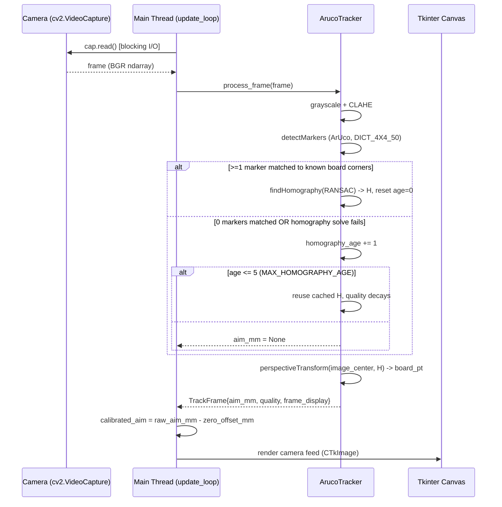
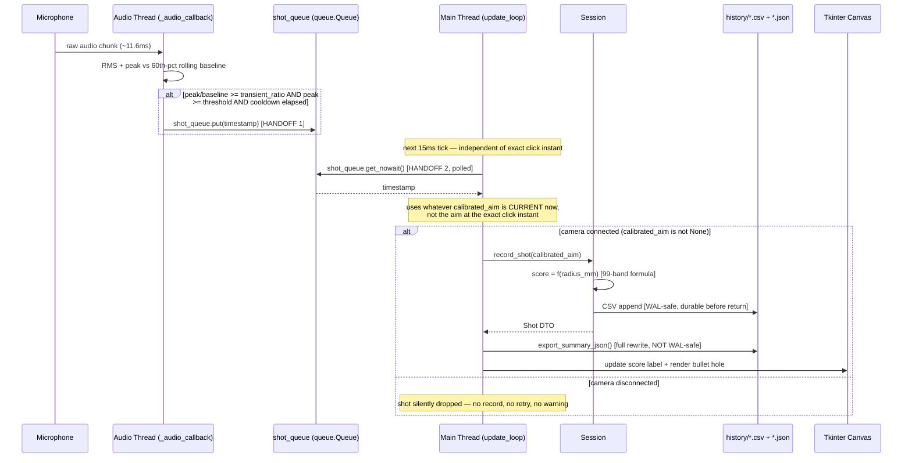
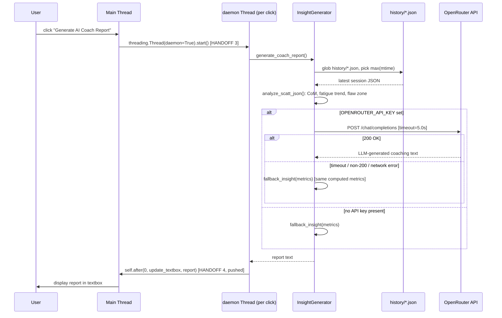

# AimGuruu — Complete Data Flow

*(Part of the documentation set indexed in **[`ARCHITECTURE.md`](./ARCHITECTURE.md)**. Assumes familiarity with **[`HLD.md`](./HLD.md)**'s component diagram and concurrency model, and **[`LLD.md`](./LLD.md)**'s per-module detail.)*

Three sequence diagrams cover every corner of the runtime behavior — a fourth generic "data flow diagram" would only restate `HLD.md` §2's component diagram, so it's deliberately omitted.

## 1. Flow A — Camera frame → aim coordinate

Full algorithm detail (CLAHE, subpixel refinement, the "one marker is enough" homography subtlety) is in `LLD.md` §1.

## 2. Flow B — Dry-fire click → recorded shot → disk → UI update

This is the diagram to sketch if an interviewer asks "walk me through what happens between the trigger click and the bullet hole appearing on screen" — see `INTERVIEW_PREP.md`. Handoff mechanics are detailed in `HLD.md` §4; scoring and persistence detail is in `LLD.md` §3.

## 3. Flow C — "Generate AI Coach Report" click → OpenRouter → fallback

*(Note: this is triggered by a button click, not by "session end" — `export_summary_json()` already runs after every shot, so the JSON `InsightGenerator` reads may reflect a session still in progress.)*

Coaching-engine detail (the metrics computed, the classifier gap, the fallback guarantee) is in `LLD.md` §5.
