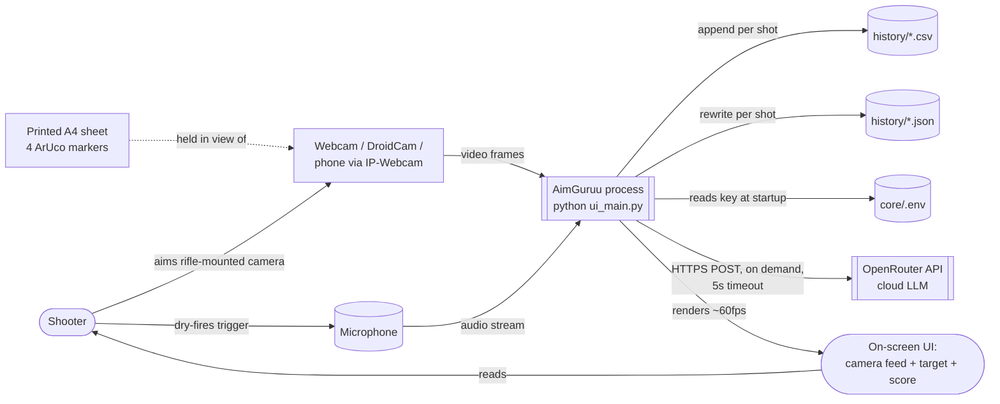
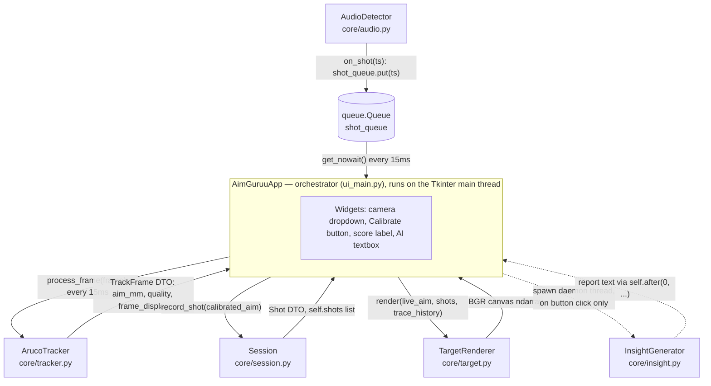
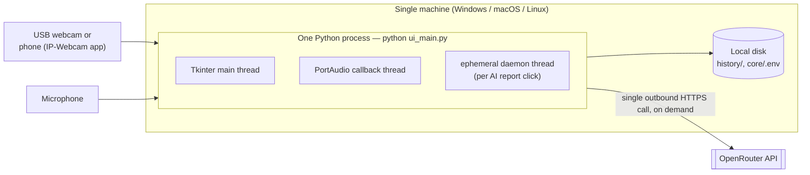
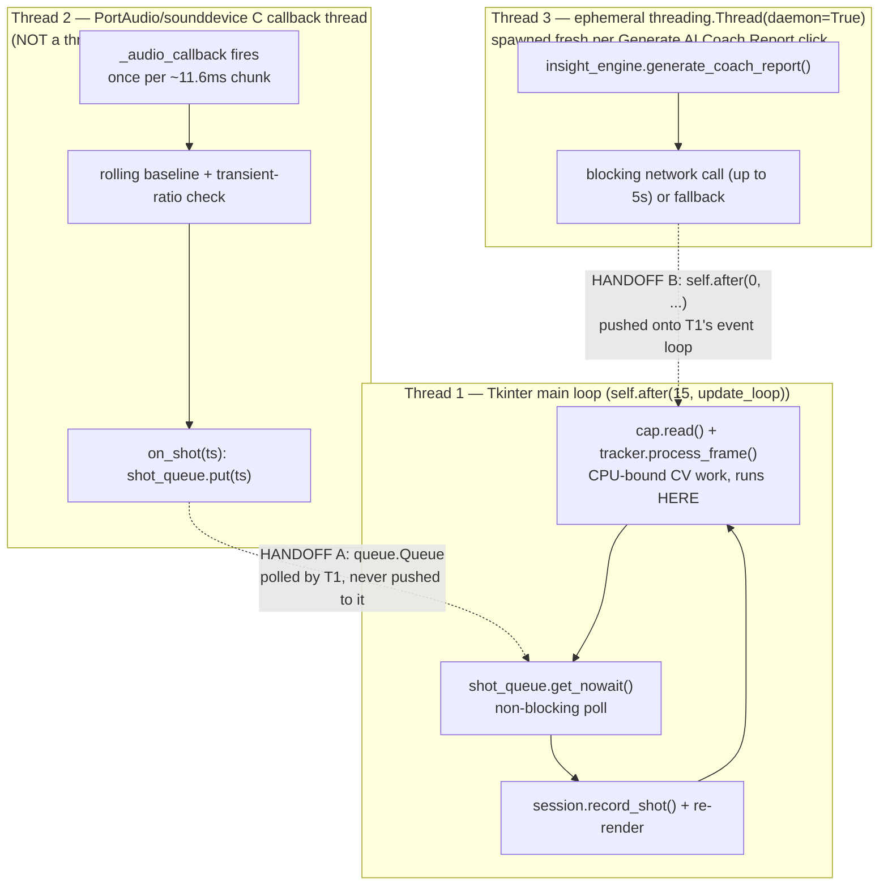

# AimGuruu — High-Level Design

*(Part of the documentation set indexed in **[`ARCHITECTURE.md`](./ARCHITECTURE.md)**. For module-by-module detail, see **[`LLD.md`](./LLD.md)**; for the runtime sequence of events, see **[`DATA_FLOW.md`](./DATA_FLOW.md)**.)*

Four diagrams, each earning its place by showing a mechanism a cold reader would otherwise have to assemble from prose: who talks to whom, where the process boundary sits, what actually runs on which thread.

*(All diagrams are Mermaid, embedded as fenced code blocks. GitHub, GitLab, and most modern Markdown viewers render these natively; in VS Code, install the "Markdown Preview Mermaid Support" extension if your preview shows raw text instead of a diagram.)*

## 1. System Context

**What this says:** AimGuruu is a single process with no server of its own. It has exactly one outbound network dependency (OpenRouter, and only when the user clicks "Generate AI Coach Report"), and its only persistent store is the local filesystem. There is no database, no accounts, and nothing multi-tenant — that absence is deliberate for the current scope (see `ARCHITECTURE.md` ADR-006) and is the main thing Phase 2/3 of the roadmap (`ARCHITECTURE.md` §4) exists to change.

## 2. Component Diagram

**What this says:** `AimGuruuApp` is the only component that talks to every other component — nothing talks to anything else directly. `shot_queue` is drawn as its own node deliberately: it's the entire thread-safety boundary between the audio subsystem and everything else, not an implementation detail. Full behavior of each of these five components is in `LLD.md`.

## 3. Deployment View

**What this says — mostly by omission:** there is no app server, no database server, no load balancer, no message broker, no container orchestration. One machine, one process, three threads, one outbound call. That's not a gap in the diagram — it's the actual topology, and `ARCHITECTURE.md` §4 is precisely the roadmap for what has to be added to each layer to reach an enterprise deployment.

## 4. Concurrency & Threading Model

This is the single most interview-relevant diagram in this documentation set. AimGuruu has **three execution contexts that are not symmetric with each other** — conflating them (e.g., saying "it's multi-threaded" without distinguishing *how*) is the easiest way to sound like you don't actually understand your own system.

Two things worth being precise about, because they're genuinely different mechanisms:

- **Handoff A (audio → UI) is pull-based.** The audio thread never touches the UI. It only ever does `shot_queue.put(timestamp)`. The main thread polls `shot_queue.get_nowait()` on its own 15ms cadence and simply won't notice a shot until the next tick — worst case ~15ms of added latency, which is irrelevant next to human reaction time but matters for exactly *which* video frame's aim point gets attributed to the shot (see `DATA_FLOW.md`, Flow B).
- **Handoff B (AI worker → UI) is push-based.** `self.after(0, callback, report)` schedules `callback` to run on the Tkinter event loop as soon as it's next idle — this is Tkinter's sanctioned way to marshal a result from a background thread onto the thread that owns the UI. There's no polling and no queue involved.
- **Thread 2 is not `threading.Thread`.** `sounddevice.InputStream` hands its callback to PortAudio, a C library, which runs it on its own OS thread. This is worth stating precisely in an interview — "I spawned a background thread for audio" is not quite what happened; the audio library owns that thread, and `_audio_callback` is just the function it calls into.
- **`AudioDetector.pause()` is designed but unwired.** It exists, is `threading.Lock`-guarded, and is checked inside `_audio_callback` — but nothing in `ui_main.py` currently calls it. It's there for a "mute audio while in a menu" feature that was never connected to a UI control. Worth naming as "designed, not yet wired up" rather than either claiming it's a feature or pretending it doesn't exist.
