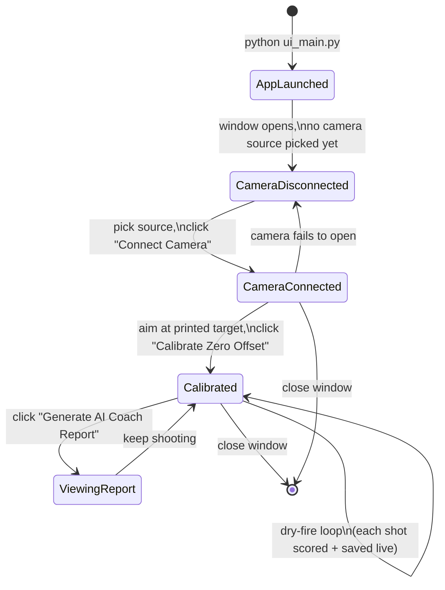

# AimGuruu — User Workflow

*(Part of the documentation set indexed in **[`ARCHITECTURE.md`](./ARCHITECTURE.md)**. Written from the perspective of the two personas the app already serves — see **[`TARGET_PERSONAS.md`](./TARGET_PERSONAS.md)**. For what the code is doing underneath each step, see **[`LLD.md`](./LLD.md)** §6 and **[`DATA_FLOW.md`](./DATA_FLOW.md)**.)*

## Overview: One-Time Setup vs. Every Session

The workflow splits cleanly into things done **once** (install, print, position) and things done **every practice session** (connect, calibrate, shoot, review). Conflating the two is the most common source of confusion for a first-time user — a coach handing this to six athletes only needs to walk through setup once per machine, not once per athlete.

## Stage 1 — One-Time Setup

1. **Install dependencies.** `pip install -r requirements.txt`, plus `pip install sounddevice` separately — the requirements file has a known drift bug (lists `pyaudio`, the code imports `sounddevice`; see `ARCHITECTURE.md` §4, Phase 0).
2. **Print the target sheet.** An A4 sheet with 4 ArUco markers (`DICT_4X4_50`, IDs 0–3, 40mm each, 8mm margin from each edge — the exact geometry `LLD.md` §1 tracks against) mounted on a wall or board. There is currently no generator script in this repo for this sheet — it has to be produced externally (an online ArUco generator plus manual layout, or a small script) and is a real, unaddressed setup gap for a non-technical user (a coach onboarding six athletes would hit this immediately).
3. **Set the API key (optional).** `OPENROUTER_API_KEY` in `core/.env` — only needed for the AI Coach's LLM path; the app runs fully without it, falling back to rule-based coaching text (`LLD.md` §5).
4. **Position the camera.** Mounted so it can see the whole target sheet — on a tripod, or (per the README) zip-tied to the rifle barrel itself if using a phone via an IP-Webcam app.

## Stage 2 — Every Session: Connect

1. Launch: `python ui_main.py`.
2. Pick the camera source from the dropdown — `0 (Default Webcam)` for a laptop cam, `1`/`2` for a second USB device or DroidCam, or `Custom IP URL` for a phone's IP-Webcam stream (the text field only appears for this option — a small UX detail, Hick's Law in `INTERVIEW_PREP.md`'s UX section).
3. Click **Connect Camera**. If it fails, the label under the button says so and the state stays `CameraDisconnected` — there's no automatic retry.

## Stage 3 — Every Session: Calibrate

1. Aim the rifle so the reticle sits on the printed target's center; the live crosshair overlay on the camera feed shows the tracker is locked on (green crosshair = good confidence, orange = degraded/stale homography — `LLD.md` §1).
2. Click **Calibrate Zero Offset**. This is a one-shot action, not a mode: it reads whatever `aim_mm` is current at that instant and stores it as the new zero point. If the camera isn't perfectly still relative to the gun mount afterward, this needs to be redone.

## Stage 4 — Every Session: Practice (the core loop)

This is where the user spends nearly all their time, and it's fully passive from the UI's perspective — there's no "start recording" button:

1. The user aims; the live trace on the target panel draws a fading, color-coded line (green → yellow → red as time-to-shot decreases — `LLD.md` §4) showing hold stability in real time.
2. The user dry-fires. The microphone (running continuously in the background, `HLD.md` §4 Thread 2) detects the click and the app scores and plots the shot automatically, with no user action beyond the trigger pull itself.
3. The score label and group-size figure update immediately after each shot.
4. Repeat for as many shots as the session calls for.

**What the user actually experiences if something goes wrong here** (not documented anywhere else from this angle):
- If the camera source disconnects mid-session, dry-fires still make an audible click and the microphone still hears it, but nothing gets scored or plotted, and there is no error message — from the user's side, this looks exactly like the app silently ignoring a shot (`LLD.md` §6's known edge case, from the person actually pulling the trigger's point of view).
- If a marker is briefly blocked (a hand, bad angle), the trace and crosshair keep moving smoothly using the cached homography for a few frames rather than freezing — the user is unlikely to notice this happened at all, which is the intended effect (`ARCHITECTURE.md` ADR-005).

## Stage 5 — After a Session: Review

1. **Score summary** is always visible live: Total, Average, and Group (Extreme Spread in mm) — no separate "end session" step is required to see these.
2. **AI Coach Report**, on demand: click **Generate AI Coach Report**. The button disables and shows "Generating..." while a background thread runs; the report — LLM-written or the rule-based fallback, the user can't tell which from the UI alone — appears in the text panel below without freezing the rest of the app (`DATA_FLOW.md` Flow C).
3. Because the JSON summary is rewritten after every single shot (not just at a defined "session end"), clicking this button mid-session reviews whatever has happened *so far*, not a completed, finalized session — worth knowing if the workflow ever gets a literal "End Session" button in the roadmap.

## Stage 6 — Data Left Behind

Every session produces a `history/session_<timestamp>.csv` (append-only, one row per shot, durable immediately) and a matching `.json` summary (rewritten after each shot). Nothing is deleted or rotated automatically — this is both a feature (full history is preserved) and a current limitation (no cleanup, no per-athlete separation; see `TARGET_PERSONAS.md`'s Club/Academy Coach persona for why that matters at scale).
